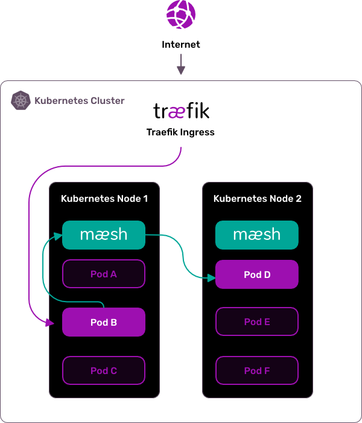

<p align="center">

</p>


[](https://travis-ci.com/traefik/mesh)
[](https://traefik.semaphoreci.com/projects/mesh)
[](https://doc.traefik.io/mesh)
[](https://goreportcard.com/report/github.com/traefik/mesh)
[](https://github.com/traefik/mesh/releases)
[](https://github.com/traefik/mesh/blob/master/LICENSE)
[](https://community.traefik.io/c/traefik-mesh)

## Traefik Mesh: Simpler Service Mesh

Traefik Mesh is a simple, yet full-featured service mesh. 
It is container-native and fits as your de-facto service mesh in your Kubernetes cluster. 
It supports the latest Service Mesh Interface specification [SMI](https://smi-spec.io) that facilitates integration with pre-existing solution. 
Moreover, Traefik Mesh is opt-in by default, which means that your existing services are unaffected until you decide to add them to the mesh.

<p align="center">
<a href="https://smi-spec.io" target="_blank"></a>
</p>


## Non-Invasive Service Mesh

Traefik Mesh does not use any sidecar container but handles routing through proxy endpoints running on each node. 
The mesh controller runs in a dedicated pod and handles all the configuration parsing and deployment to the proxy nodes. 
Traefik Mesh supports multiple configuration options: annotations on user service objects, and SMI objects. 
Not using sidecars means that Traefik Mesh does not modify your Kubernetes objects, and does not modify your traffic without your knowledge. 
Using the Traefik Mesh endpoints is all that is required.

<p align="center">


</p>

## Prerequisites

To run this app, you require the following:

- Kubernetes 1.11+
- CoreDNS installed as [Cluster DNS Provider](https://kubernetes.io/docs/tasks/administer-cluster/dns-custom-nameservers/) (versions 1.3+ supported)
- Helm v3

## Install (Helm v3 only)

```shell
helm repo add traefik-mesh https://traefik.github.io/mesh/charts
helm repo update
helm install traefik-mesh traefik-mesh/traefik-mesh
```

You can find the complete documentation at https://doc.traefik.io/mesh.


## Contributing

[Contributing guide](CONTRIBUTING.md).
