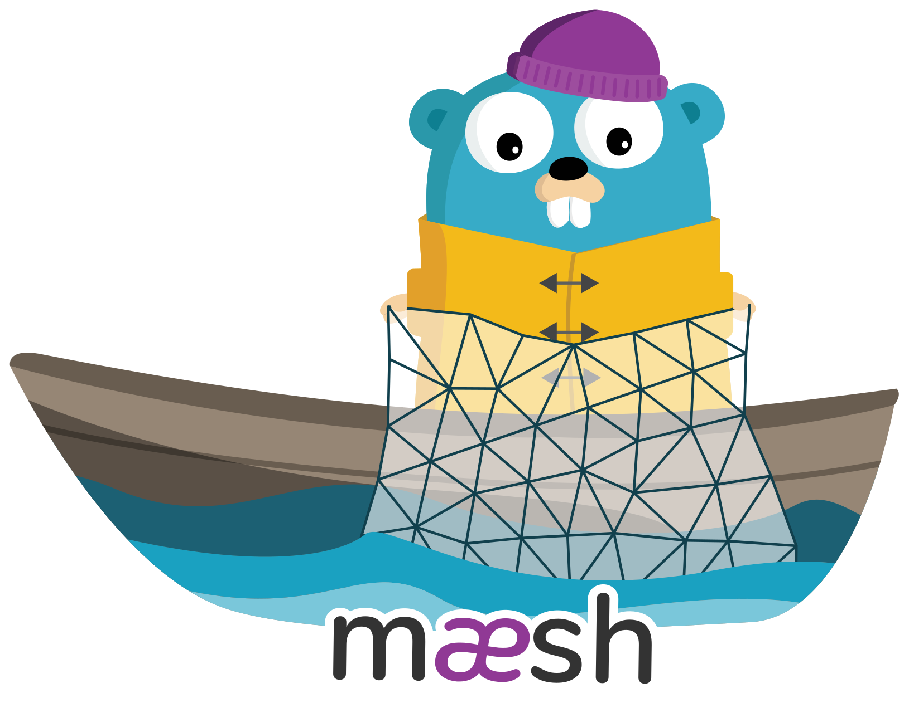
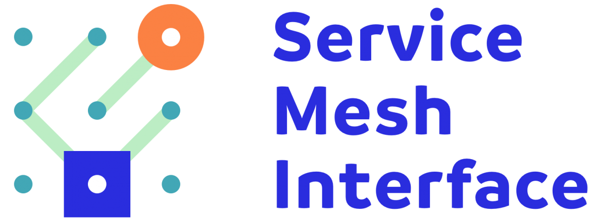
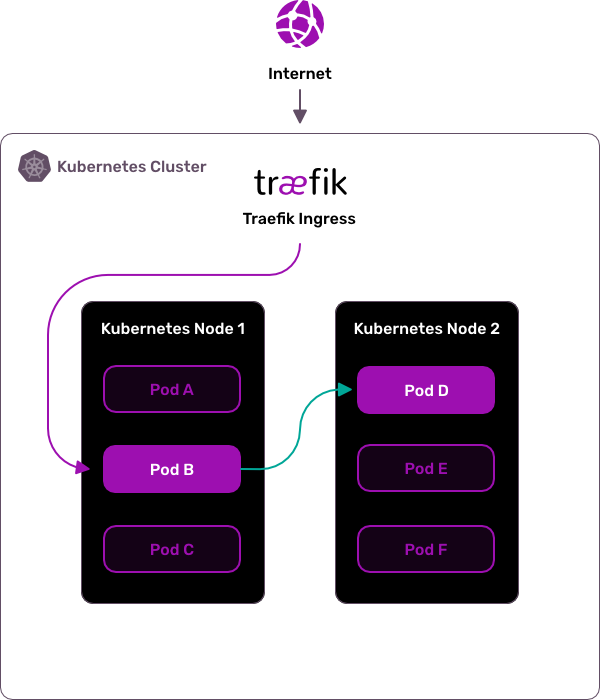
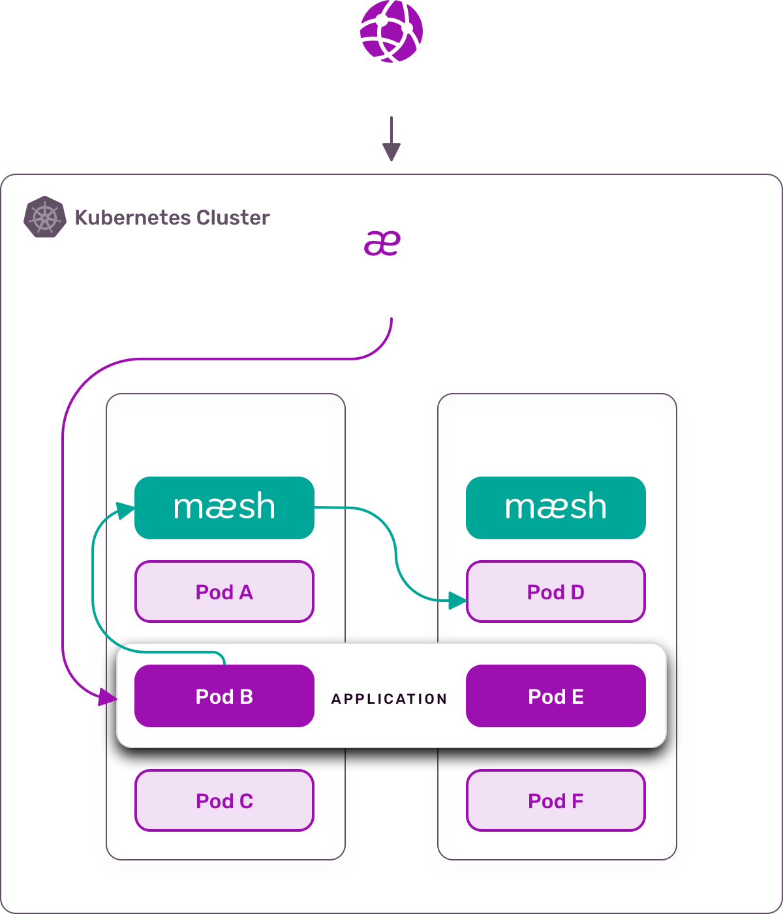

# Maesh: Simpler Service Mesh

Maesh is a simple, yet full-featured service mesh. 
It is container-native and fits as your de-facto service mesh in your Kubernetes cluster. 
It supports the latest Service Mesh Interface specification [SMI](https://smi-spec.io) that facilitates integration with pre-existing solutions. 
Moreover, Maesh is opt-in by default, 
which means that your existing services are unaffected until you decide to add them to the mesh.

## Non-Invasive Service Mesh

Maesh does not use any sidecar container but handles routing through proxy endpoints running on each node. 
The mesh controller runs in a dedicated pod and handles all the configuration parsing and deployment to the proxy nodes. 
Maesh supports multiple configuration options: annotations on user service objects, and SMI objects. 
Not using sidecars means that Maesh does not modify your kubernetes objects, and does not modify your traffic without your knowledge. 
Using the Maesh endpoints is all that is required.

## Prerequisites

To run this app, you require the following:

- Kubernetes 1.11+
- CoreDNS installed as [Cluster DNS Provider](https://kubernetes.io/docs/tasks/administer-cluster/dns-custom-nameservers/) (versions 1.3+ supported)
- Helm v2 with a [working tiller service account](https://helm.sh/docs/using_helm/#installing-tiller)
