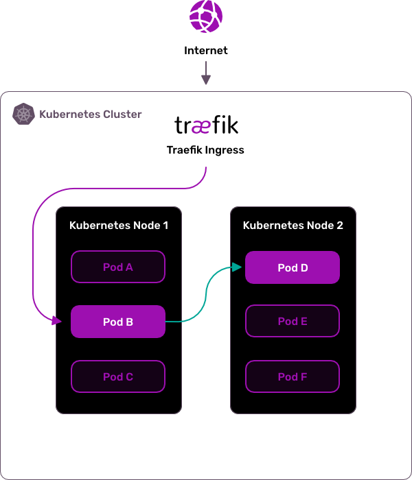
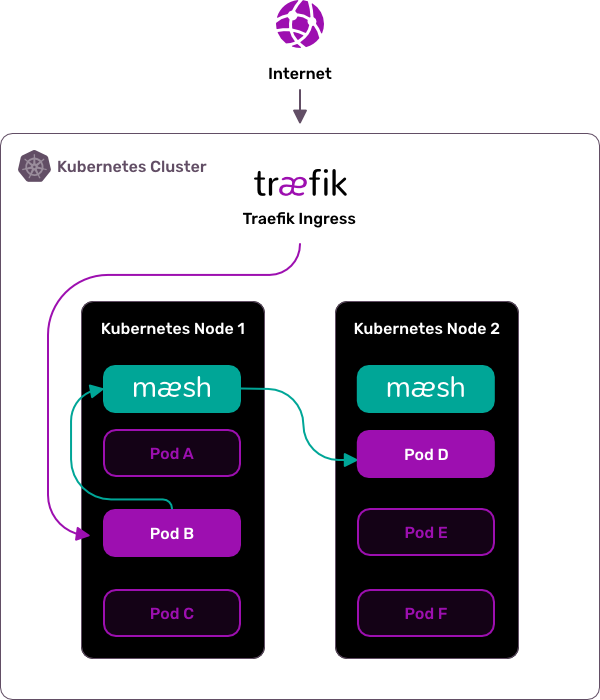

# Traefik Mesh: Simpler Service Mesh

Traefik Mesh is a lightweight and simpler service mesh designed from the ground up to be straightforward, easy to install and easy to use.

Built on top of Traefik, Traefik Mesh fits as your de-facto service mesh in your Kubernetes cluster supporting the latest Service Mesh Interface specification (SMI).

Moreover, Traefik Mesh is opt-in by default, which means that your existing services are unaffected until you decide to add them to the mesh.

## Non-Invasive Service Mesh

Traefik Mesh does not use any sidecar container but handles routing through proxy endpoints running on each node.
The mesh controller runs in a dedicated pod and handles all the configuration parsing and deployment to the proxy nodes.
Traefik Mesh supports multiple configuration options: annotations on user service objects, and SMI objects.
Not using sidecars means that Traefik Mesh does not modify your Kubernetes objects and does not modify your traffic without your knowledge.
Using the Traefik Mesh endpoints is all that is required.

## Prerequisites

To run this app, you require the following:

- Kubernetes 1.11+
- CoreDNS/KubeDNS installed as [Cluster DNS Provider](https://kubernetes.io/docs/tasks/administer-cluster/dns-custom-nameservers/) (versions 1.3+ supported)
- Helm v3
